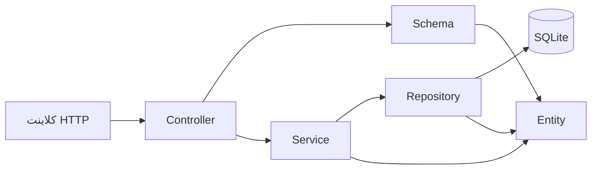

# راهنمای ساختار برنامه

این پوشه یک نمونهٔ آموزشی از معماری لایه‌ای برای FastAPI است. هر درخواست از لایهٔ HTTP وارد می‌شود، قانون‌های برنامه را در سرویس می‌گذراند و فقط در Repository به SQLite دسترسی پیدا می‌کند.



## مسئولیت فایل‌های سطح برنامه

| مسیر | مسئولیت |
| --- | --- |
| `main.py` | ساخت `FastAPI`، کنار هم گذاشتن وابستگی‌ها و ثبت Router |
| `database.py` | ساخت اتصال‌های کوتاه‌عمر SQLite، تراکنش و ساخت جدول |
| `entities/` | مدل دامنه، مستقل از HTTP و SQL |
| `repositories/` | اجرای SQL پارامتری و تبدیل رکوردها به Entity |
| `services/` | موردهای کاربردی و قانون‌های کسب‌وکار |
| `controllers/` | مسیرهای HTTP و تبدیل خطاهای دامنه به پاسخ HTTP |
| `schemas/` | قرارداد ورودی/خروجی HTTP با Pydantic |

## مسیر یک درخواست نمونه

برای `POST /tasks` این توالی رخ می‌دهد:

1. FastAPI بدنهٔ JSON را با `TaskCreate` اعتبارسنجی می‌کند.
2. Controller مقدار معتبر را به `TaskService.create_task` می‌دهد.
3. Service عنوان را `strip` می‌کند و قانون «عنوان خالی نباشد» را اعمال می‌کند.
4. Repository با `INSERT INTO tasks ... VALUES (?)` رکورد را ذخیره می‌کند.
5. Repository یک `Task` برمی‌گرداند و Controller آن را با `TaskResponse` به JSON تبدیل می‌کند.

## SQLite بدون ORM

این پروژه هیچ ORMای ندارد. `SQLiteDatabase` از ماژول استاندارد `sqlite3` استفاده می‌کند و همهٔ SQLها در Repositoryها دیده می‌شوند. مقدارهای متغیر همیشه با placeholder `?` و tuple جداگانه ارسال می‌شوند؛ بنابراین نباید SQL را با f-string یا چسباندن متن بسازید.

در شروع برنامه، lifespan جدول `tasks` را می‌سازد. فایل پایگاه‌داده در `data/tasks.db` ایجاد می‌شود و در Git نادیده گرفته می‌شود.

## اجرا

```bash
python3 -m uvicorn main:app --reload
```

پس از اجرا، مستندات تعاملی FastAPI در `http://127.0.0.1:8000/docs` در دسترس است.
